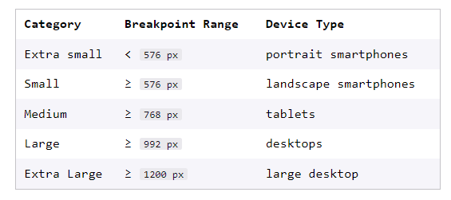

# Getting Started with Bootstrap
* Bootstrap simplifies the layout of a website using a grid system


## Intro to the Grid
bootstrap is based like this
```html
<div class="container">
  <div class="row">
    <div class="col">
      <!-- A column inside a row inside a container! -->
    </div>
  </div>
</div>
```


* uses classes to apply css rulesets
__container__ give a width relative to the user screen
__container-flud__ fillls the screen

* row will take up entire width of container
* columns are the immediate children of rows
* row will accomodate 12 columns

* use col-auto when the width of the parent should be determined by its children

## Bootstrap Breakpoints
Bootstrap categorizes screen sizes into 5 categories or as breakpoints: extra small, small, medium, large, and extra large. 


* so you can use col-sm-4, col-lg-6, to change the size at different breakpoints
* however breakpoints mean "on this screen size and greater"

# Bootstrap Utilities and Components